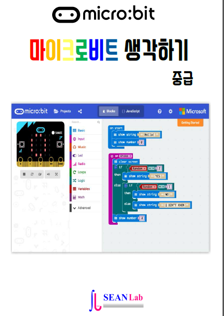

.. sphinxtemp2 documentation master file, created by
   sphinx-quickstart on Sat Nov 10 18:39:39 2018.
   You can adapt this file completely to your liking, but it should at least
   contain the root `toctree` directive.

Mighty Microbit Intermediate
=======================================

 Mighty Microbit Intermediate Lessons for Intermediate

      written by sean base on following books

.. image:: ./img/chapter0_4.png

.. toctree::
   :maxdepth: 4

   ./lessons/magic-8
   ./lessons/guess-the-number
   ./lessons/counter
   ./lessons/love-meter
   ./lessons/truth-or-dare
   ./lessons/spinner
   ./lessons/dice-roll
   ./lessons/looper
   ./lessons/strobe-light
   ./lessons/temperature
   ./lessons/digi-yoyo
   ./lessons/rotation-animation
   ./lessons/compass
   ./lessons/zoomer
   ./lessons/glowing-pendulum
   ./lessons/classic-beatbox

